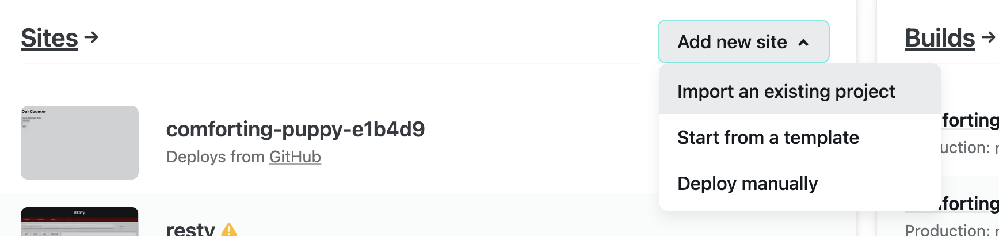
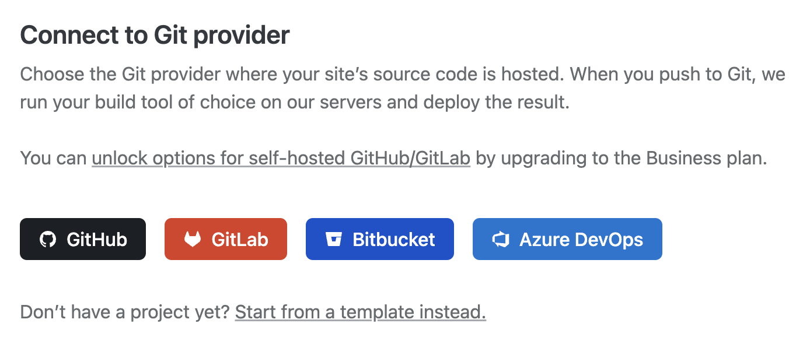
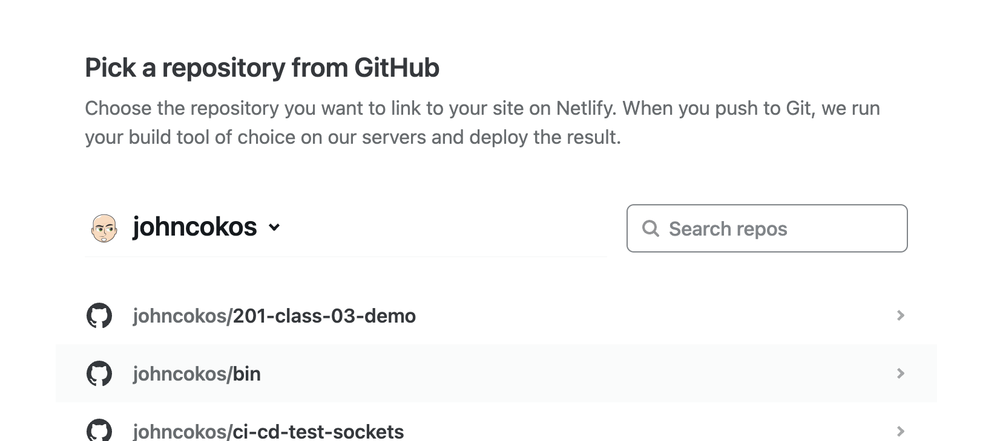
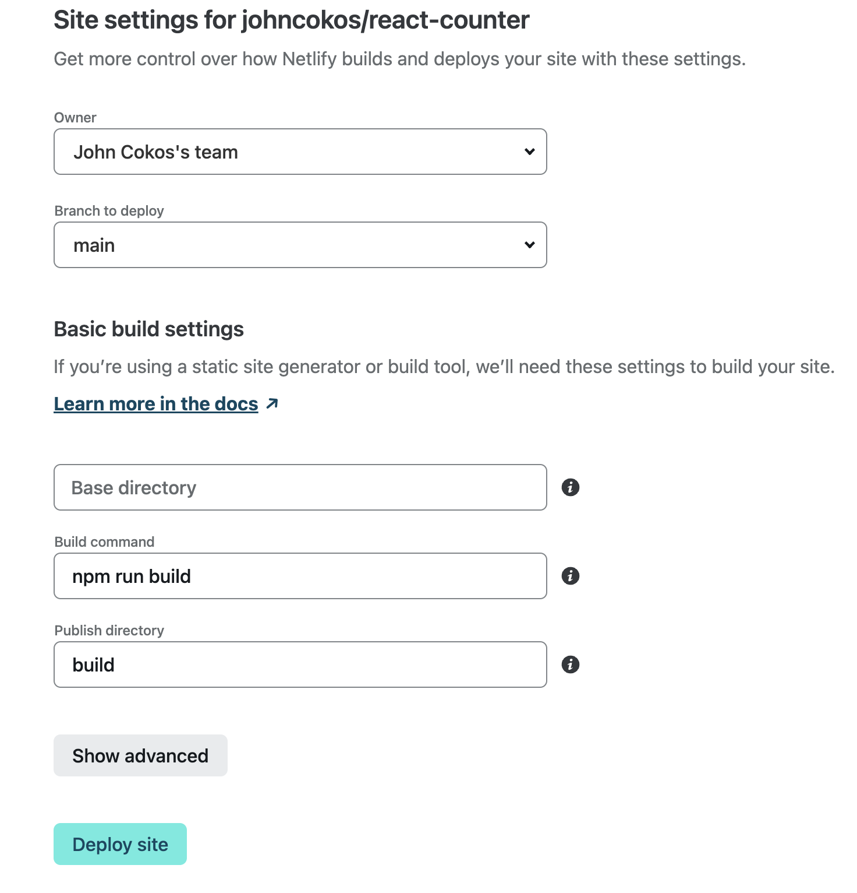
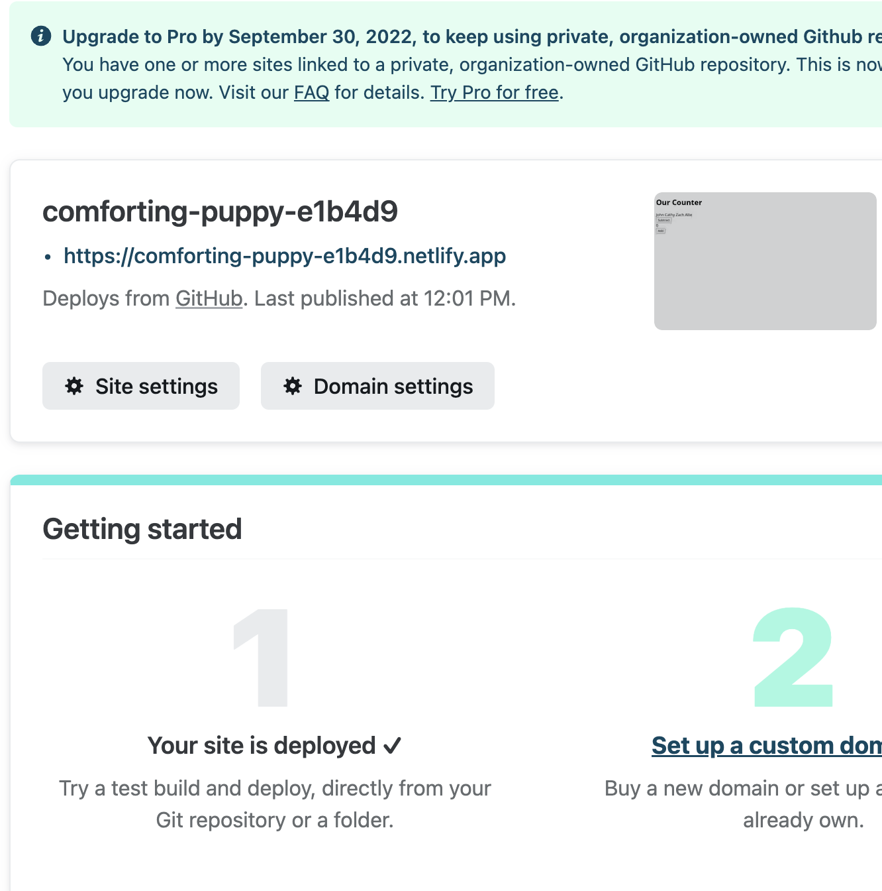

# State and Props

## Overview

Today's class will focus on passing information as `props` from a parent component into a child component. We will also cover the concept of `state` and how individual components can hold state.

## Class Outline

- Warm-up exercise
- Review code challenges
- Introduction of today's code challenge topic
- Code review of lab assignment
- Code Demo
- Bootstrap
- Lab Preview

## Learning Objectives

### Students will be able to

#### Describe and Define

- State
- Props
- React-Bootstrap
- Netlify
- setState

#### Execute

- Understand and define the concepts of `props` and `state` as they relate to React Components
- Pass both static and dynamic information from a parent component into a child component using `props`
- Hold information as `state` in different components
- Create responsive web pages suitable for desktop or mobile web browsers
- Integrate a 3rd party component library into a React application
- Deploy to Netlify

## Notes

1. What is state?

1. What are props?

1. To Update State: `this.setState({ thingInState: thingToUpdate })`

1. To send something in props to a child component: `<ChildComponent bananas='randomString' />`

1. To access that variable in the props from the child component: `this.props.bananas`

1. Information flows in one direction. That direction is ______________.

1. What is Bootstrap?

1. What are different things that I can customize using Bootstrap?

1. How does Bootstrap use classes for customization?

1. Holding state in a parent component and sending it into a child component:

  ```javaScript
  import React from 'react';
  import Child from './path-to-Child-component';

  class Parent extends React.Component {
    constructor(props);
    this.state={
      name: 'sue',
      childName: 'bob'
    }

    render() {
      return (
        <>
          <p>My name is {this.state.name}</p>
          <Child kidsName={this.state.childName}>
        </>
      )
    }
  }

  export default Parent

  import React from 'react';

  class Child extends React.Component {
    render() {
      return(
        <p>My name is {this.props.kidsName}</p>
      )
    }
  }

  export default Child
  ```

## React Bootstrap

1. Go to the [Getting Started](https://react-bootstrap.github.io/getting-started/introduction) page
1. Install react bootstrap by navigating in your terminal to the folder with your react app and installing
    `npm install react-bootstrap bootstrap`
1. Then, open your index.js file and `import` the bootstrap CSS as noted
    `import 'bootstrap/dist/css/bootstrap.min.css';`
1. When working on your application, rather than use boring ugly html markup in your JSX, choose a well designed and styled [Bootstrap Component](https://react-bootstrap.github.io/components/alerts/) instead!
   - Note that every component has a good visual and sample code included in their documentation

## Deployment at Netlify

1. Create an account at [Netlify](https://www.netlify.com)
1. Use your "GitHub" account to authenticate yourself
1. Click the "Add new Site" button and choose "From existing project" from the main page once you're logged in.
    
1. Choose "GitHub" as your provider (you may have to give permission)
    
1. Identify your repository from the list
    
1. Accept the defaults and click the "Deploy Site" button
    
1. Netlify will pull down your `main` branch and build your application
1. Once done, it'll give you a link to your LIVE website!
    
